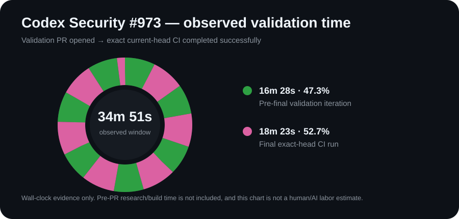
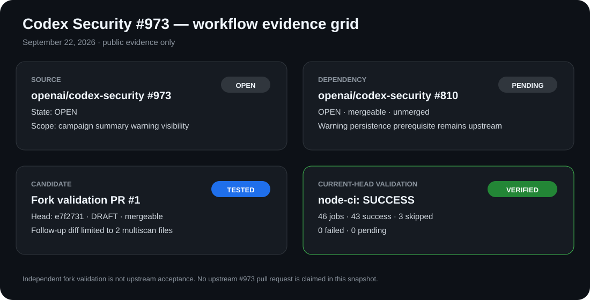

# CML GitHub Work Record

> Public, evidence-bound record of human-led, AI-assisted GitHub repair work.

**Purpose:** show what is live, verified, blocked, or waiting on an authorized human—without claiming upstream acceptance, completion, or autonomous action.

## Current state

Readback: **2026-09-22T23:33:02Z**. This is the landing-page status picture; dated journals retain the full source links, observations, and corrections.

| Item | Head | Operational state | Last verified | Next actor |
| --- | --- | --- | --- | --- |
| [FHIR Server #5829](https://github.com/microsoft/fhir-server/pull/5829) | `512dad5` | **BLOCKED** — a maintainer-triggered Azure pipeline completed with failures on 21 Sep; `Check Metadata` remains failed. | 22 Sep 2026 | Upstream maintainer — review CI and required PR metadata. |
| [OpenAI Go #932](https://github.com/openai/openai-go/pull/932) | `ff30d417` | **HOLD** — open, mergeable, unmerged; this readback has no usable upstream CI result. Fork validation is separate evidence. | 22 Sep 2026 | Upstream CI / maintainer — authorize or return a review result. |
| [Codex Security #973 — fork candidate #1](https://github.com/cstolting-collab/ccstolting-collabodex-security/pull/1) | `e7f2731` | **VERIFIED ON FORK** — node-ci: 43 successful, 3 skipped, 0 failed, 0 pending. Draft; no upstream PR submitted. [Issue #973](https://github.com/openai/codex-security/issues/973) and prerequisite [#810](https://github.com/openai/codex-security/pull/810) remain open. | 22 Sep 2026 | Human decision — submit upstream or keep holding. |

`BLOCKED`, `HOLD`, and `VERIFIED ON FORK` are different operational gates. They are not completion gauges, and the board does not show effort allocation.

## Method

CML/Fermata keeps a work item understandable through change: its accepted state, evidence, owner, boundary, next actor, and human approval remain visible.

`STATE → HANDOFF → OWNERSHIP → VALIDATION → NEXT ACTOR → HUMAN AUTHORITY`

The public rule is simple: **Read · Verify · Prepare · Hold.** A tool may prepare evidence; an authorized person still controls external messages, submissions, merges, payments, and final claims.

Evidence labels describe what is known: `IMPLEMENTED`, `VERIFIED`, `OBSERVED`, `INFERENCE`, `HYPOTHESIS`, `PROPOSAL`, and `UNKNOWN`. Operational labels describe the gate: `VERIFIED`, `HOLD`, `FAILED`, `BLOCKED`, and `UNKNOWN`.

## Journals

- [2026-09-22 — Codex Security #973 exact-head validation and Agents Python #5088 performance evidence](journals/2026-09-22.md)
- [2026-09-19 — Positive Progress, FHIR scope correction, metadata failure, and next-actor handoffs](journals/2026-09-19.md)
- [2026-09-18 — initial public record; historical scope, superseded where noted](journals/2026-09-18.md)

## Corrections and historical snapshots

The former three-PR pie dashboard was a **19 Sep snapshot** and its repeated 35 / 40 / 25 estimate was a standing collaboration estimate, not an outcome or status metric. It has been replaced on this landing page by the current status board.

The original evidence remains in the dated journal. In particular:

- [FHIR #5829 scope correction](journals/2026-09-19.md#evidence-correction--fhir-5829)
- [FHIR metadata failure and CI-coverage correction](journals/2026-09-19.md#correction--metadata-failure-and-ci-coverage)
- [Positive Progress: six contributions, exact revisions, and limits](journals/2026-09-19.md#positive-progress)

## Separate validation evidence

These are validation records, not status or labor-allocation charts.

### Codex Security #973

The draft fork candidate completed exact-head node-ci with **43 successful, 3 skipped, 0 failed, and 0 pending**. Its **34m 51s** chart is an observed wall-clock validation window, not human/AI labor attribution. [Read the record](journals/2026-09-22.md).

### OpenAI Agents Python #5088

The exact benchmark head `a67a69d0313ea2d216318cf4e05dc431bfde48a7` passed the full **18 / 18** fork validation matrix after a live Modal workload benchmark completed successfully. The observed median was **3.4937s** for the shell baseline and **2.7945s** for the native read (**−20.0% code-path median delta**), with correctness parity verified first.

[Benchmark evidence](https://github.com/cstolting-collab/openai-agents-python/actions/runs/35788913197) · [Exact-head CI matrix](https://github.com/cstolting-collab/openai-agents-python/actions/runs/35788918171) · [Full evidence record](journals/2026-09-22.md#performance-evidence-state)

> This is measured implementation evidence. It is not a claim of 20% human-time savings, upstream acceptance, release, or production deployment.

## Public boundary

Private workflow mechanics, credentials, unpublished patches, local paths, and internal CML/Fermata orchestration are not published here. An open PR is not a completed result; a fork pass is not upstream acceptance; a merged PR is not automatically a release or production verification.

---

**Human-led. AI-assisted. Evidence-bound.**
