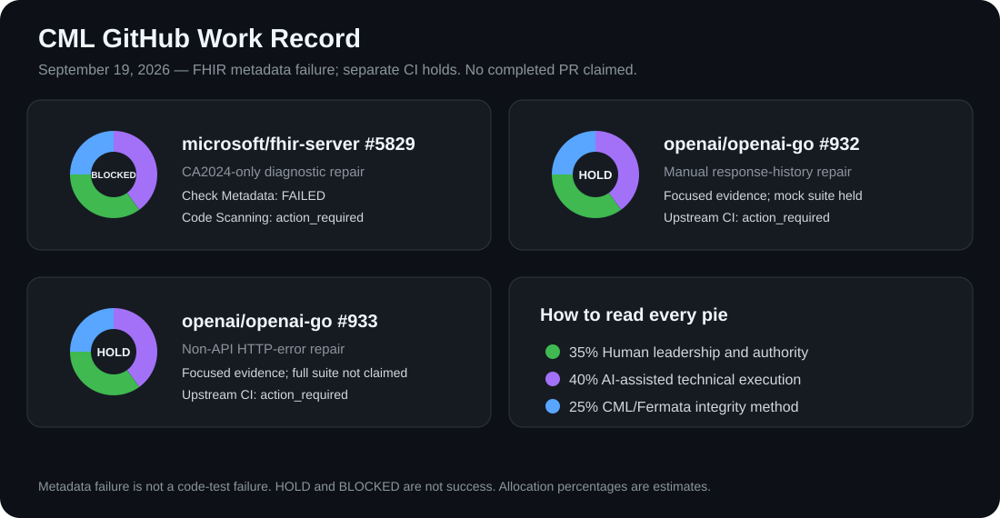

# CML GitHub Work Record

> Quiet public record of human-led, AI-assisted GitHub repair work.

**PLEASE VALIDATE ALL GITHUB WORKFLOW.**

Scope · evidence · tests · permissions · CI gates · published state.
Nothing is called complete until it is verified.

## What this repository is

This is a public, evidence-bound record of the GitHub issues and pull requests I actively work on with CML/Fermata and AI assistance. Each tracked pull request receives:

1. A direct source link and exact revision.
2. Its observed public state and evidence limits.
3. An estimated collaboration pie chart.
4. A dated journal with ownership, exceptions and a next-actor handoff.

It is not a personal activity feed, a claim of upstream acceptance, or a claim that an AI acted independently. Private, unpublished, duplicate, or unrelated work stays out.

## Current PR dashboard

The pie in every card is an **estimated work-contribution allocation**, not time tracking, legal ownership, or a productivity score: **35% human leadership and authority, 40% AI-assisted technical execution, and 25% CML/Fermata integrity method.** Human authorship, approval, and accountability remain mine.

The dashboard is intentionally limited to the three active pull requests currently being monitored. Snapshot: **September 19, 2026**; see the dated journal for observation time, full SHAs and primary workflow links. All three remain **HOLD**, not completed successes.

| Pull request / observed head | Current public state | Evidence record | Source |
| --- | --- | --- | --- |
| Microsoft FHIR Server #5829 · `512dad5` | `OPEN` · unmerged · upstream CI hold | Current scope is **CA2024 only**; other migration-era suppressions remain. PR reports a Release rebuild with 0 errors and 125 focused tests passed / 10 skipped. The two modified emulator-dependent tests were not executed locally. Returned Code Scanning run is `action_required`; full required-gate coverage is not established. | [PR #5829](https://github.com/microsoft/fhir-server/pull/5829) · [Issue #5679](https://github.com/microsoft/fhir-server/issues/5679) |
| OpenAI Go #932 · `0d11494` | `OPEN` · unmerged · upstream CI hold | Focused regression, vet and diff-check commands are recorded in the PR. Mock-backed endpoint suite was not run because a pinned dependency could not be fetched. Returned upstream Actions runs are `action_required`. No tests were rerun by this record inspection. | [PR #932](https://github.com/openai/openai-go/pull/932) · [Issue #631](https://github.com/openai/openai-go/issues/631) |
| OpenAI Go #933 · `9f7f99d` | `OPEN` · unmerged · upstream CI hold | Focused tests, vet, compile-only, Castiron and diff checks are recorded in the PR; a full-suite pass is not claimed. Returned upstream Actions runs are `action_required`. No tests were rerun by this record inspection. | [PR #933](https://github.com/openai/openai-go/pull/933) · [Issue #644](https://github.com/openai/openai-go/issues/644) |

**Evidence correction:** the earlier FHIR dashboard described a broader remediation and a zero-warning build. Those statements must not be carried onto the current narrowed head. The [September 19 correction](journals/2026-09-19.md#evidence-correction--fhir-5829) preserves the reason and sources; the historical September 18 journal remains unchanged.

## CML Continuity Principle

A useful agent system must preserve enough continuity for work to move from one actor to the next without requiring the human to reconstruct the workflow.

**STATE → HANDOFF → OWNERSHIP → VALIDATION → NEXT ACTOR → HUMAN AUTHORITY**

A complete handoff carries inherited state, evidence supporting that state, current ownership, authorization boundaries, completion conditions, the next actor, and required human approvals. In this work record it also carries the exact revision, observation time, next trigger and unresolved exceptions.

The goal is not maximum autonomy. The goal is **durable continuity**.

> **When the human disappears, does the system still know who works next?**

An expected next actor is not a claimed accepted assignment. A saved instruction is not proof that the successor ran. A handoff is not called persisted until the write succeeds and the committed content is read back.

## GitHub Follow Through

The configured hourly coordinator inherits the latest journal, rechecks the three upstream contributions, investigates material changes, prepares evidence-bound repair plans or unsent replies when needed, and preserves a resume-ready handoff. The configured daily evening reporter reconciles that record. These are scheduled reporting roles, not a claim of a continuously running multi-agent service or CML compiler/runtime execution.

| Responsibility | Owner / next actor | Boundary |
| --- | --- | --- |
| Read evidence, recheck state, classify failures, prepare drafts, retain the handoff | GitHub Follow Through coordinator | Continue within existing authority; no extra 'continue' prompt is needed. |
| Reconcile the daily evidence trail and exceptions | GitHub Continuity Journal reporter | Preserve earlier entries and newer hourly records; verify writes by read-back. |
| Authorize upstream CI or accept/reject a contribution | Appropriately authorized upstream maintainer | This is the next required role where supported, not an assignment made by this system. |
| Approve external contributor actions outside the reporting boundary | Sherrie Joseph | No automatic upstream comments, pushes, submissions, reruns, reviews, merges, closures, releases or permission changes. |

Public reporting writes are limited to this README, `journals/YYYY-MM-DD.md`, and the existing `assets/pr-outcome-grid.svg`. Current file SHAs protect updates; conflicts require rereading and reconciliation. A failed write becomes a visible BLOCKED exception with the unsaved packet, not an unreported gap.

The final report contains completed work, its evidence trail, the validation result, unresolved exceptions and only genuine human approval needs. Current handoffs and specific exceptions are in the [latest journal](journals/2026-09-19.md#durable-handoff).

## Daily journals

- [2026-09-19 — Follow-through restoration, FHIR correction and next-actor handoffs](journals/2026-09-19.md)
- [2026-09-18 — Initial public record; historical scope, superseded where noted](journals/2026-09-18.md)

## Status rules

Evidence labels and operational decisions are separate.

- `IMPLEMENTED`, `VERIFIED`, `OBSERVED`, `INFERENCE`, `HYPOTHESIS`, `PROPOSAL`, `UNKNOWN` describe evidence status; no silent promotion between them.
- `VERIFIED`, `HOLD`, `FAILED`, `BLOCKED`, `UNKNOWN` describe an operational gate. State what was verified; do not use a single green label to conceal incomplete gates.
- Preserve raw CI outcomes. `action_required` is not a passed or failed code test. Pending, cancelled, skipped and unavailable results are not successful validation.

An open PR is not a completed result. Mergeable is not approved. A passing local test is not upstream acceptance. A closed-unmerged PR is not a successful merge. A merged PR is not automatically a release or production verification.

---

**Human-led. AI-assisted. Evidence-bound.**
